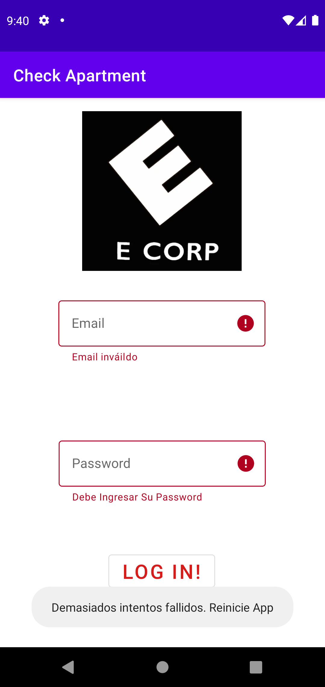
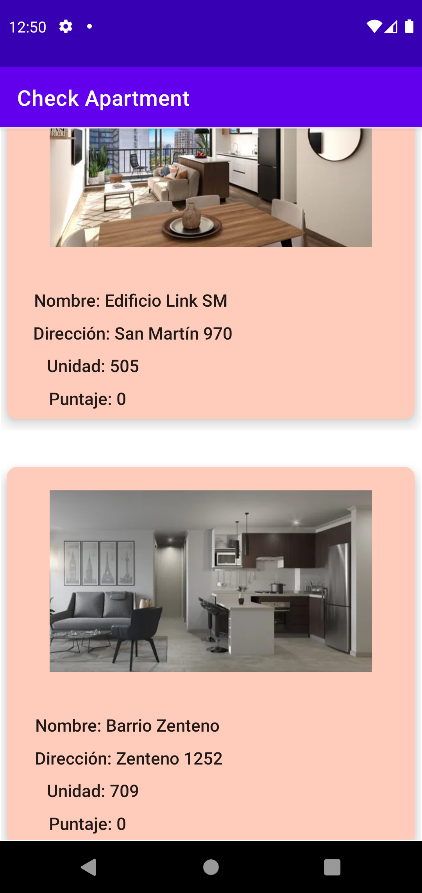
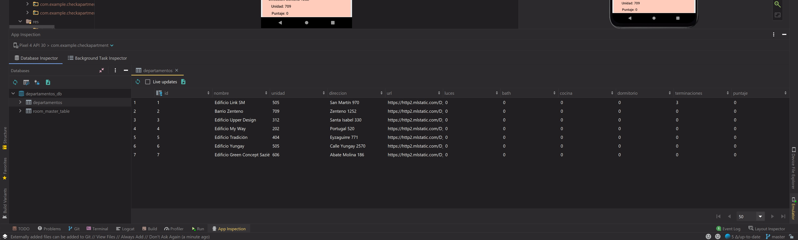
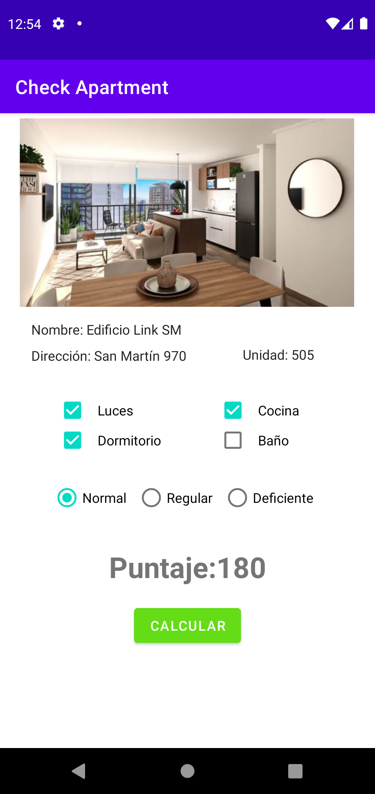
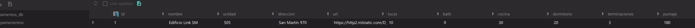
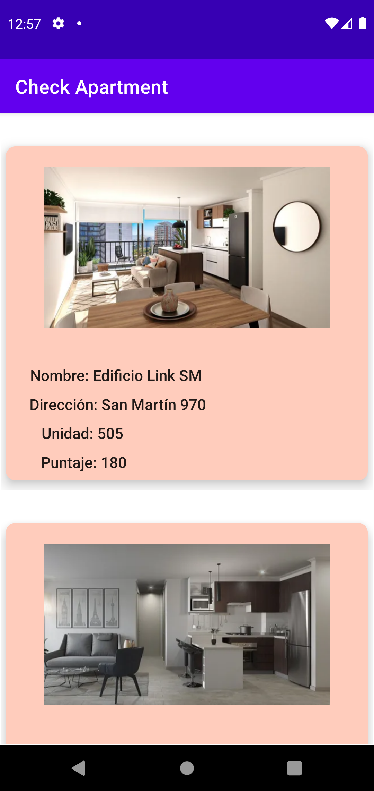
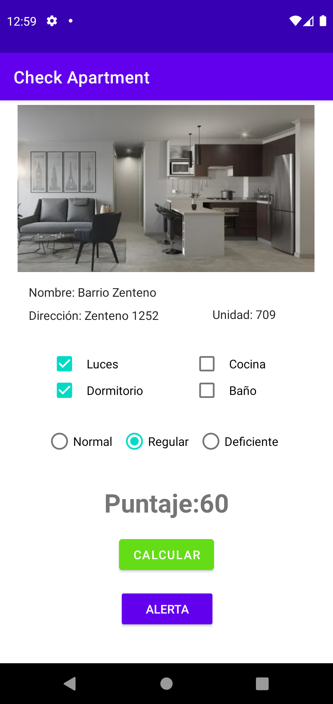
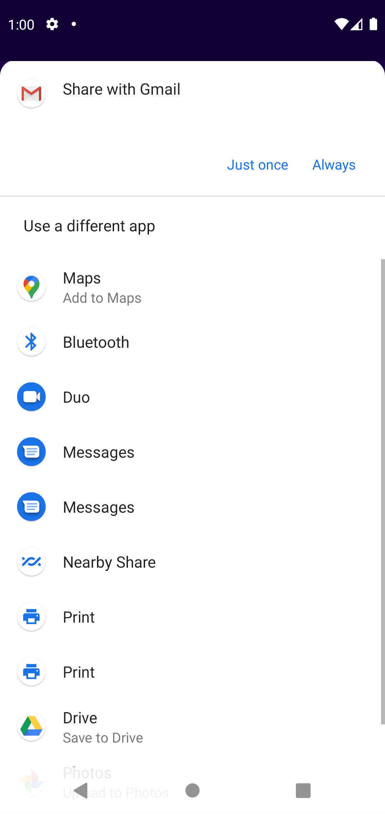

<h1> Check Apartment</h1>
###Ignacio Cavallo

## Control de Login
Si el usuario ingresa mal su email y/o contraseña o si los campos estan vacios.
 

 
 

## Bloqueo de App
Al Cumplir los 3 intentos, el boton y la app se bloquea.
 

## RecyclerView
Despues de un log in exitoso, se muestra un fragmento con un recyclerview de los departamentos. Con su nombre, dirección, unidad puntaje y su foto.
 

## Room Database
Los departamentos estan almacenados en una base de datos con ROOM
 

## Fragmento de Detalles
Al hacer click en algun elemento del RecyclcerView, a traves de navigation, nos desplazamos hacia otro fragmento con los detalles. En este se pueden seleccionar los valores requeridos por el ejercicio y al hacer click en el boton, calcula el puntaje. Notese, *que solo hay un solo boton*.
 

Como podemos observar, los cambios también se realizan en la base de datos.
 

 
Al tener persistencia de datos y LiveData, el listado se actualiza solo.
 

 
Por otra parte, si el puntaje es menor a 130, aparece un botón de alerta

 

Al hacer click en el boton de alerta, aparece un intent que nos permite enviar un correo.

 

